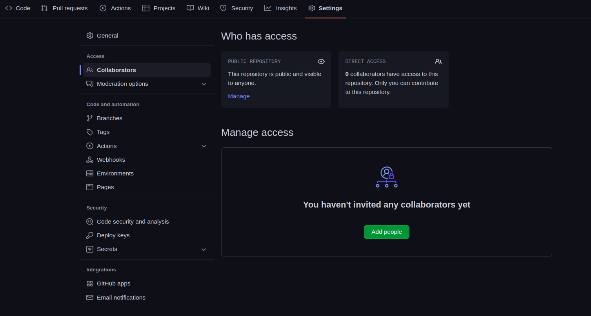

# Movie Project

This is a movie database project, where it shows movies, their casts, ratings, trailers, related movies, genres, and so on.

This project uses The Movie DB API: `https://api.themoviedb.org/3`. It is up to
you to use your Google and Postman skills to explore the API and understand the
data.

# Already built for you

- A home page that shows popular movies
- When you click one of the movies, you'll see the Single Movie page, which includes:
  - Movie poster
  - Movie title
  - Movie release date
  - Movie runtime
  - Movie description
  - An empty cast section

# What you and your partners will build

### Navbar

Add a universal navbar (it appears on every page) to the home page that includes
buttons that go to the following pages:

- Home button, takes you to the home page
- Movies button that has a dropdown list to show different movie genres. For
  example: Action, Sci-Fi, Comedy ...etc, When you click one of them it should
  load the movies for that genre.
- Actor list page
- About page that has a description of the website
- Search box where you can type the movie or actor name and display the
  related results.
- A filter dropdown to filter the displayed movies in the home page, based
  on (popular, relase date, top rated, now playing and up coming)

### Footer

Add a universal footer that includes:

- Credit to you and your partner for building the website,
- You and your partner's github link inside an icon and optionally, your social
  media links

### Styling

- Make it so that hovering over the movie makes the mouse pointer icon seem
  clickable. Right now, if you are about to click a movie, it's not obvious that
  it's clickable.

## Movies List Page

### Styling

- Using Tailwind css, display the page as a grid with 3 columns (3 movies
  in the same row)
- Make it responsive where it displays 2 columns for tablets and 1 column for
  phones
- Style the rest of the page however you like.
- Add the rating and genres to the movies in the home page and a description
  when you hover over one of them

## Single Movie Page

We build part of the single movie page for you, but the information isn't
totally complete, a few more features are needed:

- The main 5 actors of the movies in the credit section
- The movie language
- A related movies section which includes at least five related movies
- A trailer section that has the movie trailer from youtube
- The movie production company name and logo
- The director name
- The movie rating and how many votes has it received

### Functionality

- Clicking an actor in the main actors should go to the single actor page.

### Other requirements

- There's an issue with duplication in the movie page that has to be fixed (and
  you need to open the site and read the code to fix it)
- Style the page however you like

## Actor List Page

Displays a list of actors styles in the same way as the movies list page, but
with the actor photo and the actor name. Clicking any actor should go to the
Single Actor Page. CSS should most certainly be reused here!

## Single Actor Page

This page can be reached by clicking on an actor in the actors list page or the
credits in the single movie page.

### Data Display

- The actor name
- The actor gender
- A picture of the actor
- The actor popularity
- The birthday of the actor and (if available) death day
- A biography about the actor
- A list of movies the actor participated in

## Teamwork guide

In this project we will be practicing the work enviornment similar to the one we will have during our capstones so please read the following section carefully and feel free to do your research or ask us any questions incase you need help

### Repo managment

- One of the teammates will have to fork this repo and then add other teammates as collaborators to the project
  
- Now that everyone is added as collaborators, make sure to clone the repo to your local machine because this is where we will do all our work
- To collaborate effectively together you will follow an approach similar to [SCRUM](https://www.atlassian.com/agile/scrum)

### Project planning

_please read this section carefully and follow these steps during the project_

- The first phase of the project we would like you to have a meeting with your teammates and start to map out the tasks you will need to do to finish the project, ex: Work on the single actor page, Style the current home page, Work on the navbar, etc.

- Some of the tasks might be big so make sure to split these into smaller tasks that you can finish in a day or two, ex: Fetch data for the actor page, Style the actor page, Style the navbar, etc.

- On your repository create an issue for each task you will be working on with a description of what you will be doing and assign it to the person who will work on this issue (You will see an issues tab on the repo)

- We recommend assigning issues that you think you can finish in a week, this way you can keep track of your progress and make sure you are not overloading yourself with too many tasks

- [Daily standup meetings](https://www.youtube.com/watch?v=er9gntPjTJU) is a great way to keep track of your progress and make sure you are on the same page with your teammates, we recommend having a meeting every morning to discuss what you did yesterday, what you will be doing today and if you have any blockers

- You will repeat this process weekly until you finish the project

### Git workflow

- Now that you have your issues created, you can start working on them, make sure to create a new branch for each issue you are working on and name it something like `actor-page` or `navbar` and then push your code to that branch

- After you push your branch to the repo, you can create a pull request and assign it to your teammate who will review your code and merge it to the main branch, make sure to link the issue to the pull request so it will be closed automatically once the pull request is merged

- After two of your teammates have reviewed your code and approved it, you can merge it to the main branch, please watch this video on how to [review code](https://www.youtube.com/watch?v=HW0RPaJqm4g)

- These are things to look for while you are reviewing code:

  - Is the code clean and easy to read?
  - Are there any bugs?
  - Is the code efficient?
  - Is the code following the best practices?

## Bonus

If you finish early you can work on the same functionalities, but for TV shows.
Your code should be completely reusable (e.g., don't just copy paste a second
copy of the files).
